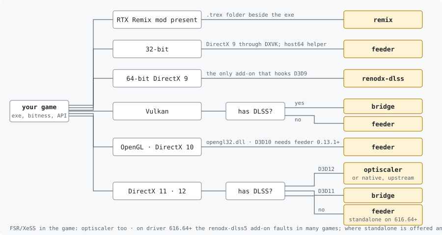

# DLSS 5 Autopilot

Puts DLSS 5 neural rendering into games that never shipped it. Scans your
library, reads each executable, picks the route that fits the game and your
card, downloads every part from its publisher, writes the configuration,
and can take all of it back out. One `.exe`, nothing to install, no admin.

**[Download the latest release](../../releases/latest)** · Windows 10/11 ·
NVIDIA RTX 20 or newer

> This repository holds installer logic only. No game files, no NVIDIA
> binaries, no third-party code is redistributed - everything is fetched at
> run time from the original publishers. [Credits and licensing](#credits-and-licensing).

## What DLSS 5 is

A network that runs over a finished frame and re-lights it: materials,
skin, tone. NVIDIA shipped it on 3 September 2026 in NBA 2K27, for RTX 50.
The community wired it into other games through ReShade add-ons and an
OptiScaler fork, and re-targeted the runtime so RTX 40, 30 and 20 run it
too. This tool automates that setup. Unofficial, early, and the parts
change daily - the tool resolves the current versions every time it runs.

## Using it

1. Run `dlss5-autopilot.exe`. It scans Steam, Epic, GOG, EA, Ubisoft,
   Battle.net, Rockstar, Amazon, itch, Heroic, Xbox/Game Pass, `D:\Games\*`
   folders and 18 emulators. Anything else: **Choose folder**.
2. Pick the game. The card shows what was read - executable, 32/64-bit,
   graphics API, whether it ships DLSS - and the route it will take.
3. Press **INSTALL**. The log says what went where. Then start the game and
   press the key the tool named; **did it work?** reads the game's logs
   afterwards and tells you in plain words.

Uninstall removes exactly what was written, restores anything it replaced,
and nothing else.

## Which route a game gets

<p align="center"> remix; 32-bit -> feeder; 64-bit DX9 -> renodx-dlss; Vulkan -> bridge with DLSS, feeder without; OpenGL and DX10 -> feeder; DX11/12 with DLSS -> native (D3D12) or bridge (D3D11), without -> feeder or optiscaler" width="900"></p>

The dropdown lists every route the game allows, marks the recommended one
and greys out what your card cannot run. The card under it says, per
route, what it does and what must not sit in the same folder.

| Route | What it is | For | Fps dial |
|---|---|---|---|
| **native** | Krish's `renodx-dlss5` add-on hooks the DLSS calls the game already makes | 64-bit D3D12 games with DLSS | the game's DLSS mode |
| **neural-upstream** | matiasLombo's add-on runs the network at render resolution, *before* the game's DLSS upscales | 64-bit D3D12 games with DLSS | cadence (every 1st/2nd/3rd frame) |
| **optiscaler** | Dagherbou's OptiScaler fork replaces the upscaler and runs the model over its output; no ReShade | 64-bit D3D11/12 with DLSS, or with FSR 2/3 / XeSS redirected into DLSS | **model resolution 25-100 %** - cost falls with the square; optional **frame generation** (FSR 3.1, any card, D3D12) |
| **bridge** | NIGos' `dlss5-bridge` mirrors the game's DLSS contract onto a private D3D12 session | D3D11 and Vulkan games with DLSS | the game's DLSS mode |
| **feeder** | jlrouzies-fr's `DLSS5-Feeder` builds a DLAA contract from ReShade's depth buffer and shader motion vectors | games with **no** DLSS: D3D10/11/12, Vulkan, OpenGL, 32-bit (host64 helper), DirectX 9 (DXVK) | work area 50-100 % (64-bit D3D11) |
| **standalone-dlssnr** | kibblerz's add-on: own feed, DLAA or DLSS Super Resolution, frame generation, shown through its own window | 64-bit D3D11/12, with or without DLSS; experimental | run the game below native |
| **renodx-dlss** | ShortFuse's add-on hooks D3D9/11/12 in-process; no bridge, no shaders | 64-bit DirectX 9 (nothing else reaches it); reported failing in many other games | the game's DLSS mode |
| **remix** | the game has an **RTX Remix** mod; DLSS 5 runs inside the Remix runtime, after its upscaler. Nothing injected | any game with a `.trex` folder beside it | Remix's Neural Uplift sliders |

**Two rules that override the picture.** A Remix mod present means *remix*,
always - ReShade crashes a Remix game before it draws. And nothing here
goes into online games: ReShade with add-ons and anti-cheat do not coexist,
so BattlEye, EAC and Vanguard titles are marked blocked.

### Frame generation

Two switches, both off by default, both honest about what they are:

- **Frame generation, any RTX card** (optiscaler route, D3D12). OptiScaler
  ships AMD's FSR 3.1 frame-generation libraries; the tool turns them on
  with the upscaler it already runs as the input. One generated frame per
  rendered one - 2x - on RTX 20 through 50. Turn the game's own frame
  generation off; expect added latency; the HUD is the part that varies
  by game.
- **Multi-frame generation on RTX 40** (ReShade routes, D3D12 and Vulkan).
  dashdogy's [RTX40MFG-Unlock](https://github.com/dashdogy/RTX40MFG-Unlock)
  raises the multiplier of a DLSS Frame Generation the game *already has*
  to 3x/4x, in memory, with the Ada temporal correction; the tool places it
  with [Ultimate ASI Loader](https://github.com/ThirteenAG/Ultimate-ASI-Loader)
  under a proxy name the executable imports. Offered only on an RTX 40 and
  only when `nvngx_dlssg.dll` or `sl.dlss_g.dll` is in the folder. Research
  software: higher multipliers and Vulkan can freeze or crash. The
  multiplier is chosen in ReShade's **DLSS MFG** tab.

The first works in any D3D12 game on the optiscaler route; the second only
raises a multiplier the game already has. NVIDIA's own multi-frame
generation stays an RTX 50 feature.

## Your graphics card

`nvngx_dlssnr.dll` is compiled per architecture. NVIDIA's build is FP8 for
RTX 50; the community re-targeted it for older cards. The tool detects the
card, picks the matching build, then opens the file and checks its CUDA
fatbin records against the card before installing it.

| Card | Build | Cost |
|---|---|---|
| RTX 50 | `310.8.0`, NVIDIA's own | full speed |
| RTX 40 | `310.8.0-RTX40`, community, sm_89 | moderate |
| RTX 20 / 30 | `310.8.SF` / `SF-v2`, community, FP16 | heavy - about half your fps at 100 % model resolution; use the dial |
| GTX, RTX 16 | - | does not run |

Swapping the DLL alone does nothing on any card: a game has to *ask* for
neural rendering, and outside NBA 2K27 none do. That request is what the
add-on or OptiScaler makes.

## In the game

| Route | Keys |
|---|---|
| optiscaler | **Insert** opens the overlay; neural rendering is already on |
| native · bridge · neural-upstream | **Home** → DLSS 5 tab → neural rendering on; keep the game's DLSS on |
| feeder | **Home** → tick `LUMENITE: Kernel 2.0` (or VORT) and `DLSS 5 Feed`, provider above the feed → DLSS 5 panel → on. 32-bit games: the panel is a separate helper window beside the game |
| renodx-dlss | **Home** → RenoDX DLSS tab; already on |
| remix | **Alt+X** → Developer Settings → Post-Processing → Enable Neural Uplift |
| standalone-dlssnr | **F10** compares |

Everywhere: MSAA/SSAA off. Set resolution and display mode **before**
turning neural rendering on - the feature is built for one back-buffer
size, and a rebuild mid-session is where crashes live. Prefer borderless
over exclusive fullscreen for the same reason. *"No .fx files found"* in
ReShade's overlay is normal on the add-on routes; the add-on tab is what
matters.

## Settings worth knowing

- **Model resolution** (optiscaler): 75 % is about half the cost of 100 %,
  50 % a quarter. The frame keeps full detail; only the model's
  contribution is computed small.
- **Feeder build**: stable, newest pre-release, or any exact release when
  the newest breaks a game. Builds before 0.8 pair with add-on 4.55 and the
  tool pins it. OpenGL games are pinned to 4.60 (4.70 stalls on GL).
- **Motion vectors** (feeder): LumeniteFX Kernel by default; **VORT
  Motion** (optical flow) on OpenGL, where LumeniteFX reads nothing - the
  tool installs whichever is chosen and puts it above the feed.
- **Profiles**: save the dials under a name; Quality / Balanced /
  Performance are built in.
- **scan library at start** (games page): off means no scan at all -
  *rescan* and *choose folder* still work. The scan never walks a whole
  disk (launcher registries, `XboxGames`, folders named Games and the
  like, emulator locations) and skips removable drives.
- **What will happen?** lists what INSTALL would write, back up and remove,
  without writing anything.
- **Before / after** puts the last two ReShade screenshots side by side.
- **Check versions**: games you set up earlier are checked against what
  their publishers offer now; **update (N newer)** appears in the list.
- The tool updates itself: a new release downloads in the background, its
  SHA-256 is checked against the `SHA256SUMS.txt` GitHub published, and the
  top bar offers a one-click restart. `"auto_update": false` in
  `%LOCALAPPDATA%\dlss5-autopilot\settings.json` keeps it manual.

## Video, YouTube, webcam

The feed does not care what draws the frame. The **video and youtube** card
fetches a portable MPC-HC into a folder of your choice, sets its renderer
to D3D11 and installs DLSS 5 into it like a game. Open a file, paste a
YouTube link (played live via yt-dlp, or downloaded first), render a clip
through DLSS 5 offline with **process a file**, or point a webcam at it.
**F6** toggles the effect while playing. Neural rendering redraws the whole
window, menus included; expect text to look hand-drawn.

**Anything on your screen.** The **screen** row captures a whole monitor
(Desktop Duplication on the GPU, NVENC, 60 fps) or one window (GDI, 30 fps)
and plays it through DLSS 5 about half a second behind: a browser playing
YouTube or Twitch, an emulator, a game you would not inject anything into,
a video call. Nothing touches the source; it is watched, not hooked - so it
is for watching, not for playing.

## RTX Remix

A Remix mod rebuilds an old DirectX 8/9 game with path tracing. Once one is
installed its runtime sits in a `.trex` folder beside the game; press
**rescan**, the game appears with *remix* chosen, and INSTALL does three
things: the matching `nvngx_dlssnr.dll` into `.trex`, one line in
`rtx.conf`, and - only if you tick **swap the Remix runtime** - a
DLSS 5-capable community runtime in place of one that has no neural pass
(original backed up; experimental, it can undo a mod's own fixes).

The **rtx remix** card lists every project the tool knows about, marks the
ones in your library, and for the two that publish a complete install as a
plain zip on their own releases page - **GTA IV** and **NFS Underground 2** -
offers **download & install** from that page. Nothing is mirrored; every
other project is a link.

<details>
<summary>Known Remix projects</summary>

| Game | Mod |
|---|---|
| Portal with RTX · Portal: Prelude RTX · Half-Life 2 RTX | official, already Remix |
| Grand Theft Auto IV | [xoxor4d/gta4-rtx](https://github.com/xoxor4d/gta4-rtx) - the one this tool was tested against |
| Need for Speed: Underground 2 | [Ekozmaster/NFSU2-RTX-Remix](https://github.com/Ekozmaster/NFSU2-RTX-Remix) |
| Garry's Mod | [Xenthio/garrys-mod-rtx-remixed](https://github.com/Xenthio/garrys-mod-rtx-remixed) |
| Deus Ex | [onnoj/DeusExEchelonRenderer](https://github.com/onnoj/DeusExEchelonRenderer) |
| Thief Gold | [Night1099/thief-gold-rtx-remix](https://github.com/Night1099/thief-gold-rtx-remix) |
| Morrowind | [BrunchyChineapple/Morrowind-RTX-Remix-source](https://github.com/BrunchyChineapple/Morrowind-RTX-Remix-source) |
| Vampire: Bloodlines | [CattoSalad/VTMB-RTX-Remix](https://github.com/CattoSalad/VTMB-RTX-Remix) |
| Prince of Persia: Sands of Time | [kaminoer/pop-sot-rtx](https://github.com/kaminoer/pop-sot-rtx) |
| Saints Row 2 · Saints Row: The Third | [BRAGme/sr2-rtx-remix-proxy](https://github.com/BRAGme/sr2-rtx-remix-proxy) · [PurrsianMilkman](https://github.com/PurrsianMilkman/Saints-Row-The-Third-RTX-REMIX-compatibility-mod) |
| Red Faction · Total Overdose · Assassin's Creed II | [BRAGme/RedFaction-RTX](https://github.com/BRAGme/RedFaction-RTX) · [Utkar5hM](https://github.com/Utkar5hM/TotalOverDoseRTXRemix) · [Kamzik123/ac2-rtx](https://github.com/Kamzik123/ac2-rtx) |
| Populous: The Beginning · Silent Storm · Dungeon Keeper 2 | [xmarre](https://github.com/xmarre/Populous-3-RTX-Remix) · [WormSlayer](https://github.com/WormSlayer/silent-storm-rtx) · [mencelot](https://github.com/mencelot/dk2-dxwrapper-with-path-tracing-support) |
| GTA: Vice City · Cry of Fear · Chess Titans | [GmanRO](https://github.com/GmanRO/GTA-VICE-CITY-RTX-REMIX-.ASI-compiled-within-linux-) · [michaelabilliot](https://github.com/michaelabilliot/CryofFear_RTX-REMIX) · [Kamilkampfwagen-II](https://github.com/Kamilkampfwagen-II/Chess-Titans-RTX) |

More on [ModDB](https://www.moddb.com/rtx). Links are the authority; a mod
existing is not the same as it running well.
</details>

## When it does not work

**did it work?** reads `ReShade.log`, `dlss5-feed.log`, `OptiScaler.log`
and the Remix log and names the cause. The cases below are the ones people
actually hit.

<details>
<summary>The game closes a second after starting, no message</summary>

Some games quit the moment ReShade hooks Direct3D (Metal Gear Solid V is
the known one). The tool runs those through **DXVK**: the game renders on
Vulkan and ReShade loads as a Vulkan layer outside it. Any D3D11 game can
take that path with the checkbox on the install page or `--dxvk`; DirectX 9
always does. Use borderless there - alt-tab in exclusive fullscreen
re-creates the swap chain, and the second feature creation crashes.
</details>

<details>
<summary>Driver 616.64 or newer: everything loads, nothing changes</summary>

NVIDIA's DLSS 5 launch drivers route the neural feature into the runtime
itself, and the `renodx-dlss5` 4.6/4.7 add-on faults on every evaluate
there (measured by the feeder's author: 4.7 passes 0/300, 4.55 passes
300/300). Since 1.7.0 the tool installs 4.55 on these drivers; an install
made earlier needs installing again. The bridge route is unaffected
(dlss5-bridge 1.4.9 works around it in memory), and driver 616.56 works
with every build.
</details>

<details>
<summary>Everything says it works and the picture never changes</summary>

A bordered window makes the swap chain the client area - 1920x1071 instead
of 1920x1080 - and the neural result never lands on screen while every log
reports success. Use borderless or true fullscreen at the display's own
resolution, then press F6. Found on Bayonetta.
</details>

<details>
<summary>"ReShade Vulkan layer is not registered"</summary>

DirectX 9 and Vulkan games reach ReShade as a Vulkan *layer* - a registry
entry, not a file. A 32-bit game needs the 32-bit layer; ReShade's own
installer registers only the 64-bit one, and versions before 1.6.1 took
that as done. Install again: the tool adds the missing one and says so.
</details>

<details>
<summary>It worked, then stopped after a display change</summary>

The contract is built on ReShade's depth buffer, matched against the back
buffer. Borderless vs fullscreen, Windows scaling or a render scale below
100 % can leave none selected. ReShade → Add-ons → depth buffer list: one
entry must be selected; if none, turn off *Use aspect ratio heuristics*.
</details>

<details>
<summary>A Capcom RE Engine game crashes the instant ReShade loads</summary>

RE Engine rejects ReShade's add-on support on several titles, worst with
Denuvo (Resident Evil Requiem). The tool detects the engine and installs
**REFramework** first, which loads before the engine's own checks. Not
guaranteed on every title or update.
</details>

<details>
<summary>Antivirus quarantined a file</summary>

`renodx-dlss5.addon64`, `nvngx_dlssnr.dll` and OptiScaler are unsigned,
new, uncommon and hook graphics APIs - everything heuristics look for. The
tool notices the missing file and names it; restore it and exclude the
game folder. A download that dies with `SSL: DECRYPTION_FAILED` is an
antivirus or VPN inside the HTTPS connection; turn that off for the tool.
</details>

<details>
<summary>The tool does not list my game</summary>

Not every launcher is in the registry, and an executable locked at scan
time (antivirus, an updater, OneDrive placeholders) cannot be read.
**Open log file** shows what each store returned; **Choose folder** always
works. Xbox/Game Pass folders need *Enable mods* in the Xbox app first.
</details>

<details>
<summary>Reading the logs yourself</summary>

| Line | Meaning |
|---|---|
| `feature ready … DLAA` | the contract was established |
| `frame N delivered` | frames are being processed |
| `MV probe … N% non-zero` | should not be 0 % while moving |
| `CreateFeature raised exception 0xC0000005` | add-on / feeder version mismatch, or a runtime that does not match the card |
</details>

Bugs: **report a bug** in the tool opens a GitHub issue already filled in
with version, card, driver, game, route, the last diagnosis and log tails.
Nothing is sent by itself - you see it in the browser and decide.

## Command line

```
dlss5-autopilot.exe "D:\Games\Game"                 install
dlss5-autopilot.exe "D:\Games\Game" --check         detect only, write nothing
dlss5-autopilot.exe "D:\Games\Game" --remove        uninstall
dlss5-autopilot.exe "D:\Games\Game" --route feeder  native, upstream, optiscaler, renodx, bridge, feeder, standalone
dlss5-autopilot.exe "D:\Games\Game" --dxvk          run the game on Vulkan through DXVK (--no-dxvk turns the automatic choice off)
dlss5-autopilot.exe --video ["D:\DLSS5 Player"]     set up the video player
```

## Is it safe

Fair question for an `.exe` from a Discord link.

- **Every release is built by GitHub, not uploaded by a person.** A version
  tag runs [`release.yml`](.github/workflows/release.yml) on GitHub's
  runner, which builds the exe from the commit you can read, writes
  `SHA256SUMS.txt` and attaches a signed provenance attestation.
  `certutil -hashfile dlss5-autopilot.exe SHA256` against the release page;
  `gh attestation verify dlss5-autopilot.exe --repo Kizzuwatnaa/DLSS5-Autopilot`.
- **Or skip the exe**: plain Python, standard library and tkinter only, no
  PyPI packages. `git clone` and `python dlss5_autopilot.py`.
- It writes only into the game folder you pick (plus, for Vulkan games, one
  per-user registry value it announces first and removes with the last
  Vulkan game), keeps its cache in `%LOCALAPPDATA%\dlss5-autopilot`, never
  asks for administrator rights, and sends nothing anywhere: no telemetry,
  no account.
- **Network access**, and nothing else: `reshade.me`,
  `raw.githubusercontent.com`, `api.github.com`, `github.com`,
  `objects.githubusercontent.com`, `codeload.github.com`. Every URL lives in
  [`core/sources.py`](core/sources.py).
- **Antivirus warnings.** Defender's cloud heuristics (`Wacatac.B!ml`,
  `Ulthar.A!ml` - the `!ml` is a confidence score, not a match) can delete
  a brand-new release in its first hours, before enough PCs have run it;
  the same file is left alone a day later. Every release is submitted to
  Microsoft as a false positive when it is published; if it happens to
  you, Windows Security → Protection history → Restore → Allow, or run
  from source. SmartScreen's *Windows protected your PC* is the missing
  paid certificate, not the file: More info → Run anyway. Report false
  positives: <https://www.microsoft.com/en-us/wdsi/filesubmission>.

## Code signing policy

Free code signing provided by [SignPath.io](https://signpath.io), certificate
by [SignPath Foundation](https://signpath.org). Signing happens inside the
GitHub Actions release workflow, on GitHub-hosted runners; SignPath verifies
that a build came out of that workflow before it signs it, so a signed
`dlss5-autopilot.exe` is exactly what the tagged commit builds.

- **Team roles.** Author, reviewer and approver: [Kizzuwatnaa](https://github.com/Kizzuwatnaa)
  (project owner). Changes proposed by others are reviewed by the owner
  before they are merged; only the owner approves a signing request.
- **Privacy policy.** This program will not transfer any information to
  other networked systems unless specifically requested by the user. It
  downloads the components it installs from the publishers listed under
  [Network access](#is-it-safe) and sends nothing anywhere: no telemetry,
  no account. The components it installs are third-party software with
  their own terms, linked below.

## Credits and licensing

This tool is a downloader and configurator. It bundles nothing; each
component stays under its own licence, fetched from its own publisher.

| Component | Project | Licence |
|---|---|---|
| ReShade, shader headers | [crosire/reshade](https://github.com/crosire/reshade) · [reshade-shaders](https://github.com/crosire/reshade-shaders) | BSD-3-Clause · per file |
| DLSS5-Feeder | [jlrouzies-fr/DLSS5-Feeder](https://github.com/jlrouzies-fr/DLSS5-Feeder) | see repository |
| dlss5-bridge | [NIGos/dlss5-bridge](https://github.com/NIGos/dlss5-bridge) | see repository |
| neural-upstream | [matiasLombo/neural-upstream](https://github.com/matiasLombo/neural-upstream) | see repository |
| standalone-dlssnr | [kibblerz/DLSS5-Reshade-AIO](https://github.com/kibblerz/DLSS5-Reshade-AIO) | see repository |
| OptiScaler DLSS-NR fork | [Dagherbou/OptiScaler_DLSSNR](https://github.com/Dagherbou/OptiScaler_DLSSNR) | GPL-3.0 |
| LumeniteFX · VORT shaders | [umar-afzaal/LumeniteFX](https://github.com/umar-afzaal/LumeniteFX) · [vortigern11/vort_Shaders](https://github.com/vortigern11/vort_Shaders) | AGNYA · MIT |
| DXVK | [doitsujin/dxvk](https://github.com/doitsujin/dxvk) | zlib/libpng |
| REFramework (RE Engine games only) | [praydog/REFramework-nightly](https://github.com/praydog/REFramework-nightly) | MIT |
| Remix runtime with DLSS 5 (swap option only) | [lunks/dxvk-remix-plus-dlssnr](https://github.com/lunks/dxvk-remix-plus-dlssnr) | see repository |
| RTX40MFG-Unlock, Ultimate ASI Loader (multi-frame generation option only) | [dashdogy/RTX40MFG-Unlock](https://github.com/dashdogy/RTX40MFG-Unlock) · [ThirteenAG/Ultimate-ASI-Loader](https://github.com/ThirteenAG/Ultimate-ASI-Loader) | MIT · MIT |
| MPC-HC, yt-dlp, ffmpeg (video only) | their own releases | GPL / Unlicense / GPL |
| RenoDX DLSS 5 add-ons (Krish, ShortFuse), NVIDIA NGX runtimes | community mirror [RankFTW/rhi-repo](https://github.com/RankFTW/rhi-repo) | **proprietary, no public licence** |

The DLSS 5 add-ons and the NVIDIA runtimes are closed-source with no
published licence. They are not in this repository, not in the release
archive, and not redistributed here; the tool downloads them from a public
community mirror exactly as a person would by hand. If you are not
comfortable with that, do not use this tool. Remix mods are never mirrored.
Nothing here is affiliated with or endorsed by NVIDIA, ReShade, RenoDX,
OptiScaler, RTX Remix or any project above. The installer's own code is
MIT - see [LICENSE](LICENSE). Rights holders: open an issue and it will be
addressed.

Thanks to [perseval-BLR/dlss5-classic-games](https://github.com/perseval-BLR/dlss5-classic-games)
for the OpenGL and classic-game findings the tool now applies.

<details>
<summary>Building, tests, layout</summary>

```
build.bat                      needs Python 3.10+ and pyinstaller; the release build is GitHub's
python test_all.py             the whole suite
python test_install.py         end-to-end install + uninstall in temp folders
python test_clean_machine.py   empty cache, no local files
```

```
dlss5_autopilot.py    entry point (GUI + CLI)
core/games.py         library scanning     core/emulators.py   emulator profiles
core/pe.py            PE parsing, API detection, exe ranking
core/gpu.py           card, driver, CUDA architecture, build tiers
core/dlss.py          which route fits the game and the card
core/sources.py       every download URL and version pin
core/net.py           download, cache, extract
core/installer.py     install engine, route switching, uninstall
core/optiscaler.py    the OptiScaler route      core/remix*.py    the Remix route
core/vulkan.py        ReShade as a Vulkan layer  core/dxvk.py      D3D9/D3D11 -> Vulkan
core/refw.py          REFramework               core/anticheat.py BattlEye / EAC / Vanguard
core/reshade_ini.py   ReShade.ini and presets    core/feedcfg.py   feeder / bridge cfg
core/diagnose.py      logs -> plain-words verdict, bug-report body
core/components.py    are the installed parts still current?
core/update.py / selfupdate.py    update check, verified swap-in
core/video.py         MPC-HC, YouTube, offline processing, webcam
core/gui.py           interface
```
</details>
